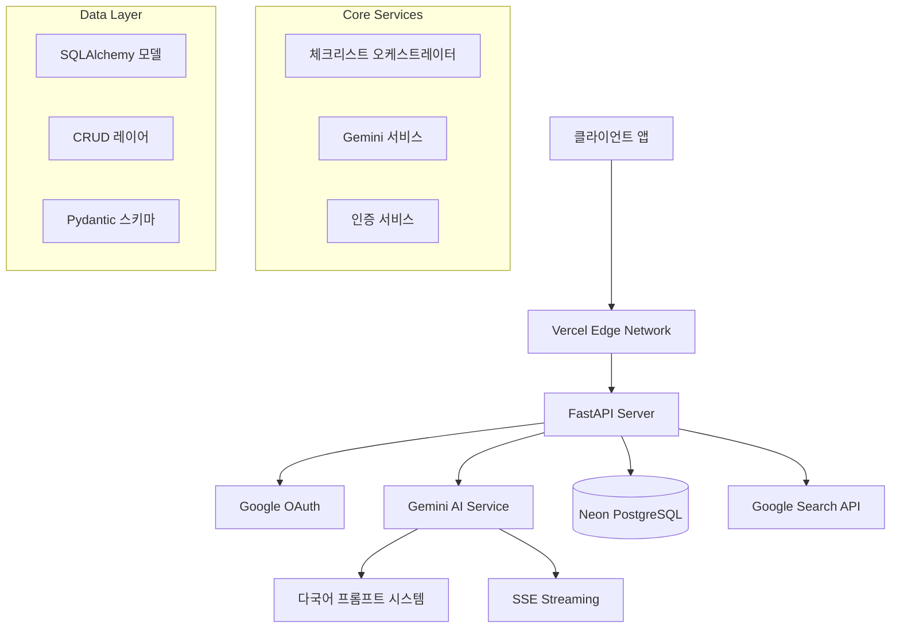
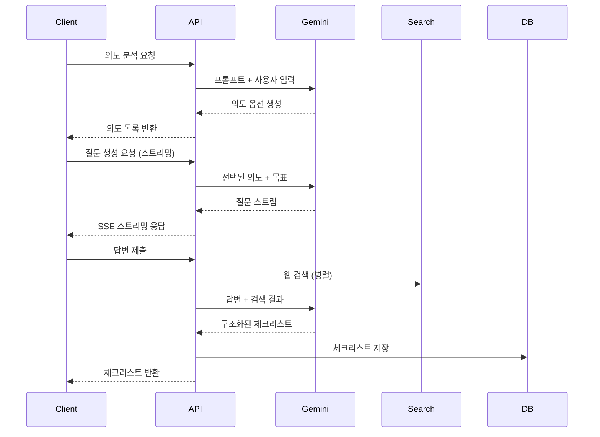
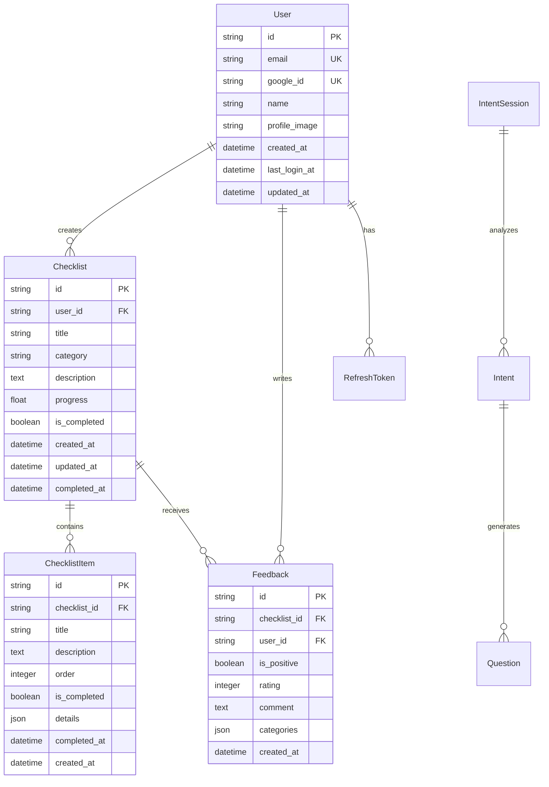
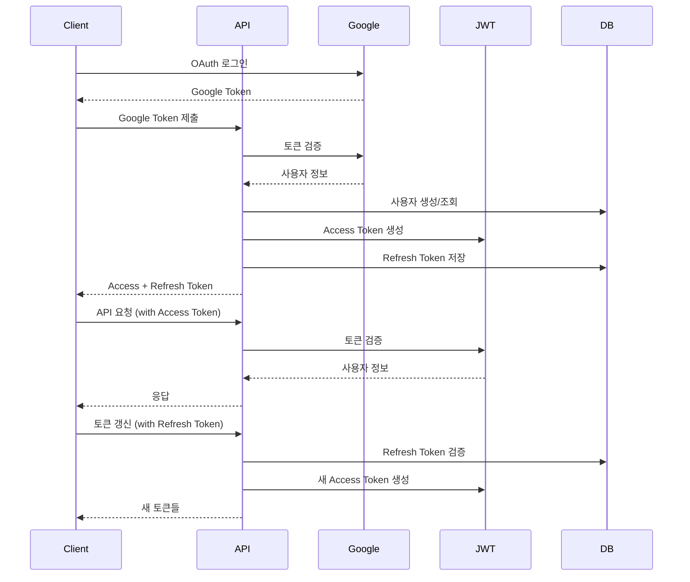

# NowWhat API 시스템 아키텍처

## 🏛️ 전체 아키텍처 개요



## 🏗️ 레이어별 아키텍처

### 1. API Layer (Presentation)
```
app/api/v1/
├── endpoints/          # REST API 엔드포인트
│   ├── auth.py        # 인증 관련 API
│   ├── users.py       # 사용자 관리 API
│   ├── intents.py     # 의도 분석 API
│   ├── questions.py   # 질문 생성/답변 API
│   ├── checklists.py  # 체크리스트 관리 API
│   └── feedback.py    # 피드백 API
└── api.py             # 라우터 통합
```

**주요 특징:**
- FastAPI 기반 비동기 REST API
- Pydantic을 통한 자동 검증
- OpenAPI 자동 문서화
- 일관된 응답 형식 (APIResponse)

### 2. Core Layer (Infrastructure)
```
app/core/
├── auth.py            # JWT 토큰 관리
├── config.py          # 환경 설정
├── database.py        # DB 연결 관리
├── security.py        # 보안 유틸리티
└── middleware.py      # 미들웨어
```

**핵심 기능:**
- 환경 변수 기반 설정 관리
- JWT + Refresh Token 인증 시스템
- PostgreSQL 연결 풀링
- CORS, 로깅, 예외 처리

### 3. Service Layer (Business Logic)
```
app/services/
├── gemini_service.py           # Gemini AI 통합
├── checklist_orchestrator.py   # 체크리스트 생성 워크플로
├── google_auth.py              # Google OAuth 처리
├── details_extractor.py        # 세부 정보 추출
└── perplexity_service.py       # 추가 AI 서비스 (예비)
```

**서비스별 역할:**
- **GeminiService**: AI 모델 호출, 스트리밍, 구조화된 출력
- **ChecklistOrchestrator**: 복합 워크플로 조율, 병렬 처리
- **GoogleAuth**: OAuth 2.0 플로우, 사용자 정보 검증

### 4. Data Layer (Persistence)
```
app/
├── models/
│   ├── database.py     # SQLAlchemy 모델 정의
│   └── storage.py      # 스토리지 유틸리티
├── schemas/
│   ├── nowwhat.py      # Pydantic 스키마
│   └── questions.py    # 질문 관련 스키마
└── crud/
    ├── base.py         # 기본 CRUD 클래스
    ├── user.py         # 사용자 CRUD
    ├── checklist.py    # 체크리스트 CRUD
    ├── feedback.py     # 피드백 CRUD
    └── session.py      # 세션 CRUD
```

## 🧠 AI 시스템 아키텍처

### Gemini AI 통합 패턴


### 프롬프트 시스템
```
app/prompts/
├── ko/                 # 한국어 프롬프트
│   ├── intent_analysis.py
│   ├── questions_generation.py
│   └── checklist_prompts.py
├── en/                 # 영어 프롬프트
│   ├── intent_analysis.py
│   ├── questions_generation.py
│   └── checklist_prompts.py
├── enhanced_prompts.py # 고급 프롬프트 (검색 통합)
├── search_prompts.py   # 웹 검색 프롬프트
└── prompt_selector.py  # 언어별 프롬프트 선택
```

**특징:**
- 언어별 최적화된 프롬프트
- 지역 정보 (countryOption) 통합
- 구조화된 출력 스키마 정의
- 웹 검색 결과 활용 패턴

## 📊 데이터베이스 아키텍처

### ERD (Entity Relationship Diagram)


### 데이터베이스 전략
- **Primary DB**: Neon PostgreSQL (Serverless)
- **Connection Pooling**: SQLAlchemy 엔진 관리
- **Migration**: Alembic 자동 마이그레이션
- **Indexing**: 성능 최적화를 위한 인덱스
- **JSON Storage**: 유연한 스키마를 위한 JSONB 활용

## 🔐 보안 아키텍처

### 인증/인가 플로우


### 보안 계층
1. **네트워크 레벨**: HTTPS, CORS 정책
2. **인증 레벨**: Google OAuth 2.0, JWT
3. **권한 레벨**: 리소스 소유권 검증
4. **데이터 레벨**: SQL 인젝션 방지, 입력 검증
5. **애플리케이션 레벨**: 레이트 리미팅, 로깅

## 🚀 배포 아키텍처

### Vercel Serverless 배포
```
┌─────────────────┐
│   Vercel Edge   │ ← Global CDN
├─────────────────┤
│  FastAPI App    │ ← Serverless Function
├─────────────────┤
│   Environment   │ ← 환경 변수 관리
└─────────────────┘
         │
         ▼
┌─────────────────┐
│ Neon PostgreSQL │ ← Managed Database
└─────────────────┘
```

### 인프라 구성
- **Frontend**: Vercel (React/Next.js) - 별도 저장소
- **Backend API**: Vercel Serverless Functions
- **Database**: Neon PostgreSQL (Serverless)
- **CDN**: Vercel Edge Network
- **Monitoring**: Vercel Analytics + 자체 로깅

## 📈 성능 및 확장성

### 성능 최적화 전략
1. **데이터베이스**
   - 연결 풀링 (SQLAlchemy)
   - 쿼리 최적화 (N+1 문제 해결)
   - 인덱싱 전략

2. **AI 서비스**
   - 스트리밍 응답 (Server-Sent Events)
   - 병렬 요청 처리
   - 토큰 사용량 최적화

3. **API 레이어**
   - 비동기 처리 (FastAPI)
   - 응답 압축
   - 캐싱 전략

### 확장성 고려사항
- **Horizontal Scaling**: Serverless 자동 스케일링
- **Database Scaling**: Neon의 자동 스케일링
- **API Rate Limiting**: 사용량 기반 제한
- **Monitoring**: 성능 메트릭 추적

## 🔍 모니터링 및 관찰성

### 로깅 전략
```python
# 구조화된 로깅
logger.info(f"🌊 Starting streaming question generation for: {goal}")
logger.error(f"❌ Failed to process request: {error}")
logger.info(f"✅ Successfully created checklist: {checklist_id}")
```

### 추적 가능한 메트릭
- **응답 시간**: API 엔드포인트별
- **에러율**: HTTP 상태 코드별
- **AI 사용량**: Gemini API 호출 수/토큰 사용량
- **사용자 활동**: 가입, 체크리스트 생성, 피드백 제출

## 🔄 개발 및 배포 프로세스

### CI/CD 파이프라인
```
코드 커밋 → GitHub → Vercel 빌드 → 자동 배포
     ↓
  테스트 실행 → 환경 변수 검증 → DB 마이그레이션
```

### 환경 분리
- **Development**: 로컬 개발 환경
- **Preview**: Vercel Preview 배포
- **Production**: 메인 프로덕션 환경

---

*이 아키텍처 문서는 현재 시스템의 실제 구현을 반영하며, 프로젝트 진화에 따라 지속적으로 업데이트됩니다.*