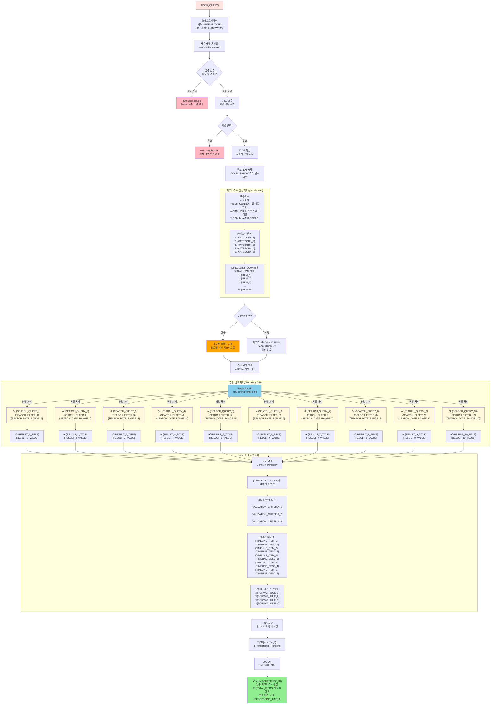

### POST /questions/answer

모든 답변을 한번에 제출하여 체크리스트 생성

**Request**

| key | 설명 | value 타입 | 옵션 | Nullable | 예시 |
| --- | --- | --- | --- | --- | --- |
| **Body** |  |  |  |  |  |
| goal | 초기 입력한 목표 | string | 필수 | No | "일본여행 가고싶어" |
| selectedIntent | 선택한 의도 | object | 필수 | No | - |
| selectedIntent.index | 의도 인덱스 | number | 필수 | No | 0 |
| selectedIntent.title | 의도 제목 | string | 필수 | No | "여행 계획" |
| answers | 질문별 답변 목록 | array | 필수 | No | - |
| answers[].questionIndex | 질문 인덱스 | number | 필수 | No | 0 |
| answers[].questionText | 질문 내용 | string | 필수 | No | "여행 기간은 얼마나 되나요?" |
| answers[].answer | 답변 | string | array[string] | 필수 | No | "3days" |

**Response**

| key | 설명 | value 타입 | 옵션 | Nullable | 예시 |
| --- | --- | --- | --- | --- | --- |
| checklistId | 생성된 체크리스트 ID | string | - | No | "cl_abc123" |
| redirectUrl | 결과 페이지 URL | string | - | No | "/result/cl_abc123" |

**Example Request**

```json
{
  "goal": "일본여행 가고싶어",
  "selectedIntent": {
    "index": 0,
    "title": "여행 계획"
  },
  "answers": [
    {
      "questionIndex": 0,
      "questionText": "여행 기간은 얼마나 되나요?",
      "answer": "3days"
    },
    {
      "questionIndex": 1,
      "questionText": "예산은 얼마나 되나요?",
      "answer": "1million"
    }
  ]
}

```

**Example Response**

```json
{
  "checklistId": "cl_abc123",
  "redirectUrl": "/result/cl_abc123"
}

```

**Status**

| status | response content |
| --- | --- |
| 200 | 체크리스트 생성 성공 |
| 400 | 필수 답변 누락 |
| 401 | 인증 필요 |
| 429 | 요청 한도 초과 |

